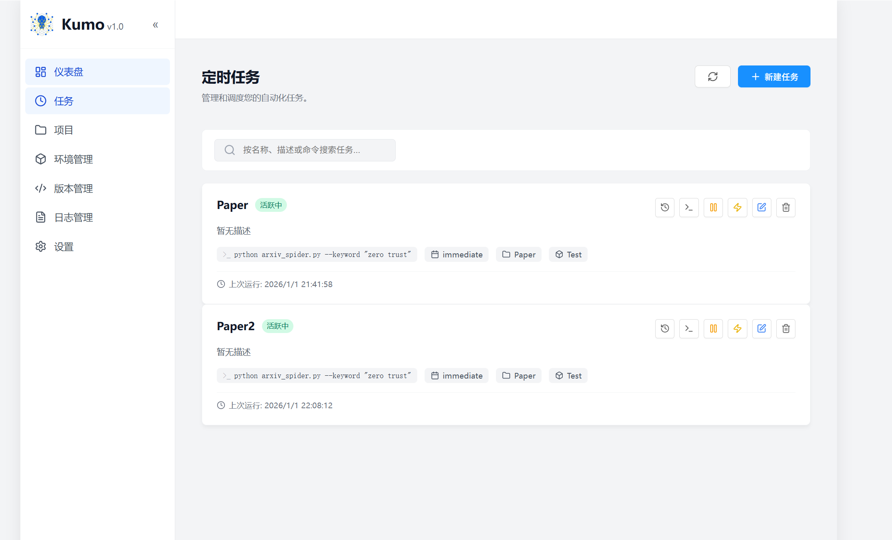
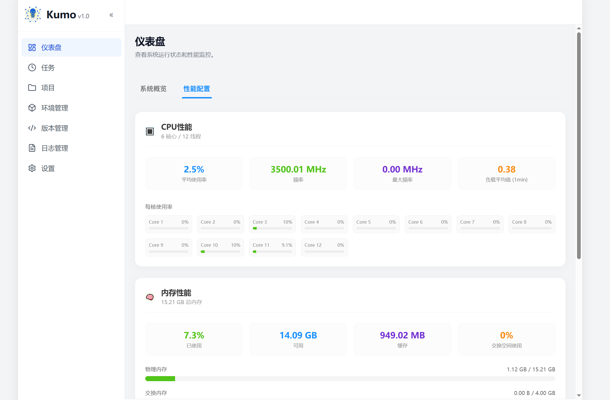

# Kumo (Spider_front) - Python 任务调度与管理平台

> 一个基于 Web 的现代化、全栈容器化的 Python 任务调度与环境管理平台。

## ✨ 项目亮点 (Features)

- **可视化任务管理**: 提供直观的仪表盘，实时监控系统资源（CPU/内存/磁盘）与任务执行状态（成功/失败/运行中）。
- **Python 环境隔离**: 深度集成的环境管理系统，支持创建和管理多个独立的 Python 虚拟环境 (Conda/Venv)，彻底解决依赖冲突。
- **灵活的调度引擎**: 基于 APScheduler 构建的强大调度核心，支持 Cron 表达式、固定间隔 (Interval) 和特定日期 (Date) 等多种触发模式。
- **项目级资源管理**: 独立的 workspace 设计，支持 ZIP 包上传、自动解压、在线文件浏览与代码热更新。
- **开箱即用开发体验**: 全栈 Docker 化架构，预配置 Volume 映射，支持代码热重载与数据持久化，一键启动即可开始开发。

## 🛠 技术栈 (Tech Stack)

- **Frontend**: Vue 3, TypeScript, Vite, Pinia, ECharts, Monaco Editor
- **Backend**: Python 3.9+, FastAPI, SQLAlchemy, APScheduler
- **Infrastructure**: Docker, Docker Compose
- **Database**: SQLite (自动初始化，零配置)

## 🚀 快速开始 (Getting Started)

### 前提条件
- [Docker Desktop](https://www.docker.com/products/docker-desktop) 或 Docker Engine
- Docker Compose

### 安装与运行
本项目已完成开发环境的 Volume 映射，启动后对宿主机代码的修改将实时生效。

1.  **克隆项目**
    ```bash
    git clone https://github.com/YourUsername/Kumo.git
    cd Kumo
    ```

2.  **一键启动**
    使用 Docker Compose 构建镜像并启动服务：
    ```bash
    docker-compose up -d --build
    ```

3.  **访问服务**
    - **前端控制台**: [http://localhost:6677](http://localhost:6677)
    - **后端 API 文档**: [http://localhost:8000/docs](http://localhost:8000/docs)

## 📂 目录结构 (Project Structure)

```text
Kumo/
├── docker-compose.yml       # 容器编排文件 (核心入口)
├── Data/                    # [Output] 爬虫/任务数据输出目录 (直通宿主机)
├── backend/                 # FastAPI 后端服务
│   ├── core/                # 核心配置 (Database, Security)
│   ├── environment_service/ # Python 环境管理模块
│   ├── task_service/        # 任务调度与执行引擎
│   ├── projects/            # [Volume] 项目代码存储区
│   ├── envs/                # [Volume] 虚拟环境存储区
│   └── data/                # [Volume] SQLite 数据库与密钥
└── front/                   # Vue 3 前端应用
    ├── src/pages/           # 业务页面组件
    └── src/styles/          # 全局样式定义
```

## ⚙️ 配置说明 (Configuration)

### 环境变量
项目配置主要通过 `docker-compose.yml` 管理，默认已包含开发所需的最佳实践配置：

- `TZ=Asia/Shanghai`: 强制容器使用上海时区，确保调度任务时间准确。
- `PYTHONUNBUFFERED=1`: 确保 Python 日志实时输出到 Docker logs。
- `WATCHFILES_FORCE_POLLING=true`: 增强 Windows 下的文件变更检测。

### 敏感信息
系统首次启动时会自动在 `./backend/data/` 目录下生成：
- `TaskManage.db`: SQLite 数据库文件。
- `secret.key`: 用于加密敏感环境变量的密钥文件。

> **注意**: 请勿将 `backend/data/` 目录下的内容提交到版本控制系统 (已配置 .gitignore)。

## 🏗️ 核心机制与开发规范 (Core Mechanics & Guidelines)

### 核心实现细节
1.  **环境管理 (`environment_service`)**
    - **安全删除**: 采用“重命名 (`_trash`) + 延迟删除”策略，解决 Windows 文件锁问题。
    - **删除保护**: 禁止删除被定时任务引用的环境。

2.  **项目管理 (`project_service`)**
    - **存储**: ZIP 上传自动解压。
    - **环境变量**: 任务执行时自动注入 `OUTPUT_DIR` (持久化存储) 和 `DATA_DIR`。

3.  **任务调度 (`task_service`)**
    - **流程**: 数据库加载 -> 注入 Env/Path -> `subprocess` 执行 -> 日志重定向。
    - **容错**: 环境路径失效时自动降级为系统默认 Python。

## 📖 API 文档 (API Documentation)

项目集成了 Swagger UI 和 ReDoc。服务启动后，可直接在浏览器中访问交互式文档：

- **Swagger UI**: [http://localhost:8000/docs](http://localhost:8000/docs)
- **ReDoc**: [http://localhost:8000/redoc](http://localhost:8000/redoc)

## 📦 部署 (Deployment)

### 生产环境部署
由于项目采用了 Docker Compose 架构，生产部署与开发环境保持高度一致。

1.  确保目标服务器已安装 Docker。
2.  上传项目文件到服务器。
3.  执行后台运行命令：
    ```bash
    docker-compose up -d
    ```
4.  查看服务日志：
    ```bash
    docker-compose logs -f
    ```

### 数据持久化
以下目录默认映射到宿主机，重启或更新容器**不会丢失数据**：
- `./Data`: 业务数据
- `./backend/data`: 系统数据 (DB/Key)
- `./backend/projects`: 项目代码
- `./backend/envs`: Python 环境


