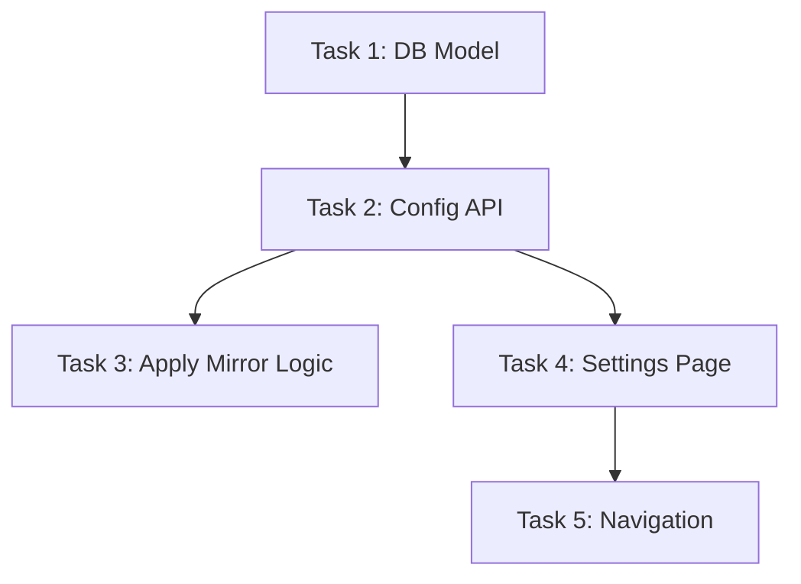

# TASK: 自定义 PyPI 镜像源配置

## 任务清单

### Task 1: 后端数据库模型与 Schema
- **目标**: 创建存储系统配置的数据库表。
- **文件**: 
    - `backend/appSystem/models.py`
    - `backend/appSystem/schemas.py`
    - `backend/main.py` (确保表创建)
- **输入**: 无
- **输出**: `SystemConfig` 模型类，`system_configs` 表结构。
- **验收标准**: 启动后端后，数据库中存在 `system_configs` 表。

### Task 2: 后端配置管理 API
- **目标**: 提供查询和修改系统配置的接口。
- **文件**: `backend/appSystem/system_router.py`
- **输入**: `SystemConfig` 模型
- **输出**: `GET /config` 和 `POST /config` 接口。
- **验收标准**: Swagger UI 可成功读写配置数据。

### Task 3: 后端镜像源应用逻辑
- **目标**: 在安装依赖时应用配置的镜像源。
- **文件**: `backend/appEnv/env_router.py`
- **输入**: `pypi_mirror` 配置值
- **输出**: 修改后的 `pip install` 命令。
- **验收标准**: 发起安装请求时，日志显示 `pip install -i <mirror_url> ...`。

### Task 4: 前端设置页面开发
- **目标**: 提供用户界面配置镜像源。
- **文件**: `front/src/pages/Settings.vue`
- **输入**: API 接口
- **输出**: 设置页面，包含镜像源输入框和快捷按钮。
- **验收标准**: 页面能显示当前配置，修改并保存后后端生效。

### Task 5: 前端路由与导航集成
- **目标**: 将设置页面接入主应用。
- **文件**: 
    - `front/src/router/index.ts`
    - `front/src/layout/MainLayout.vue`
- **输入**: `Settings.vue` 组件
- **输出**: 侧边栏或顶部栏可见"设置"入口，点击跳转正常。
- **验收标准**: 导航流畅，页面加载无误。

## 依赖关系图

