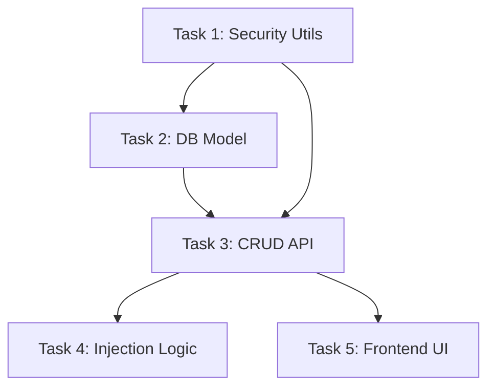

# TASK: 环境变量管理系统

## 任务清单

### Task 1: 安全模块与密钥管理
- **目标**: 实现加密/解密工具函数。
- **文件**: `backend/app/security.py`
- **输入**: 无
- **输出**: 加密工具类，自动生成 `secret.key`。
- **验收标准**: 能正确加解密字符串；重启后密钥不变。

### Task 2: 数据库模型与迁移
- **目标**: 创建环境变量表。
- **文件**: 
    - `backend/appSystem/models.py`
    - `backend/appSystem/schemas.py`
- **输入**: 无
- **输出**: `EnvironmentVariable` 模型。
- **验收标准**: 数据库包含 `environment_variables` 表。

### Task 3: 后端管理 API
- **目标**: 实现环境变量的 CRUD。
- **文件**: 
    - `backend/appSystem/env_vars_router.py`
    - `backend/main.py` (注册 Router)
- **输入**: Schema 定义
- **输出**: API 接口。
- **验收标准**: POST 创建加密数据，GET 返回脱敏数据。

### Task 4: 任务执行注入逻辑
- **目标**: 爬虫运行时注入环境变量。
- **文件**: `backend/appTask/task_manager.py`
- **输入**: 数据库中的变量
- **输出**: 修改后的 `subprocess` 调用。
- **验收标准**: 创建一个打印 `os.environ` 的测试任务，能看到注入的变量。

### Task 5: 前端管理界面
- **目标**: 在设置页面管理环境变量。
- **文件**: `front/src/pages/Settings.vue`
- **输入**: API
- **输出**: 环境变量管理表格。
- **验收标准**: 能增删改查变量，UI 体验良好。

## 依赖关系图

